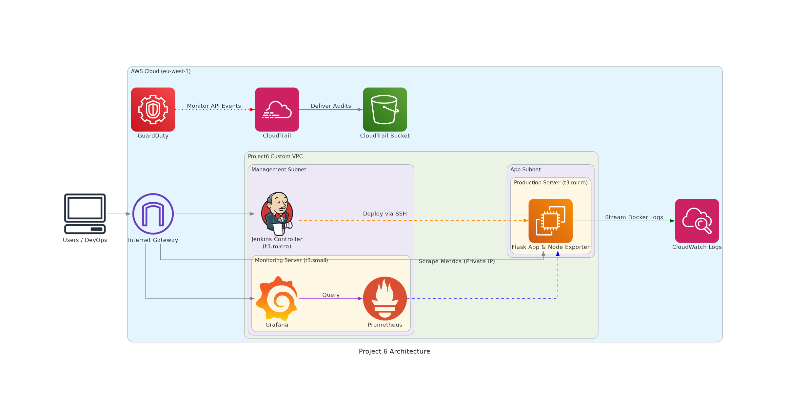
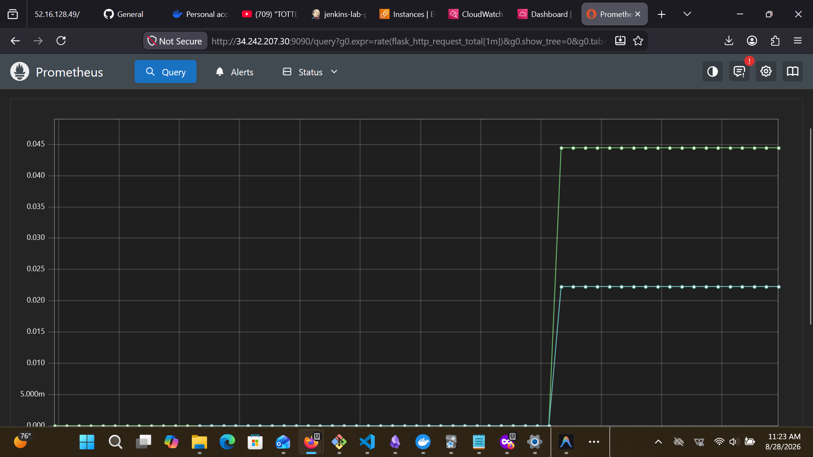
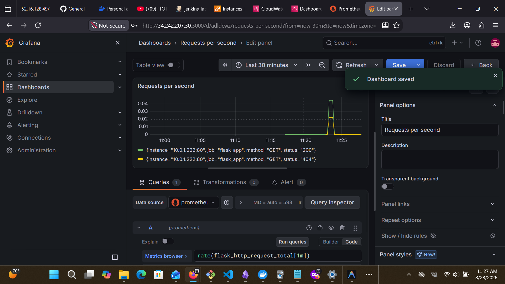
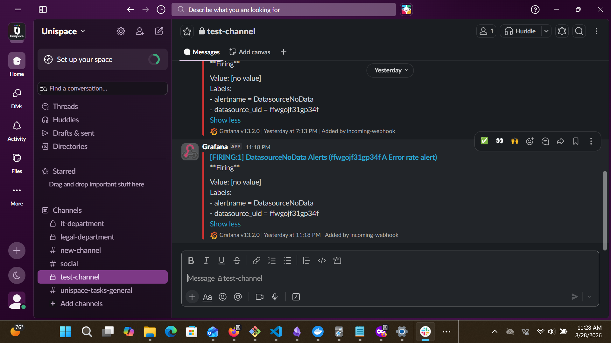
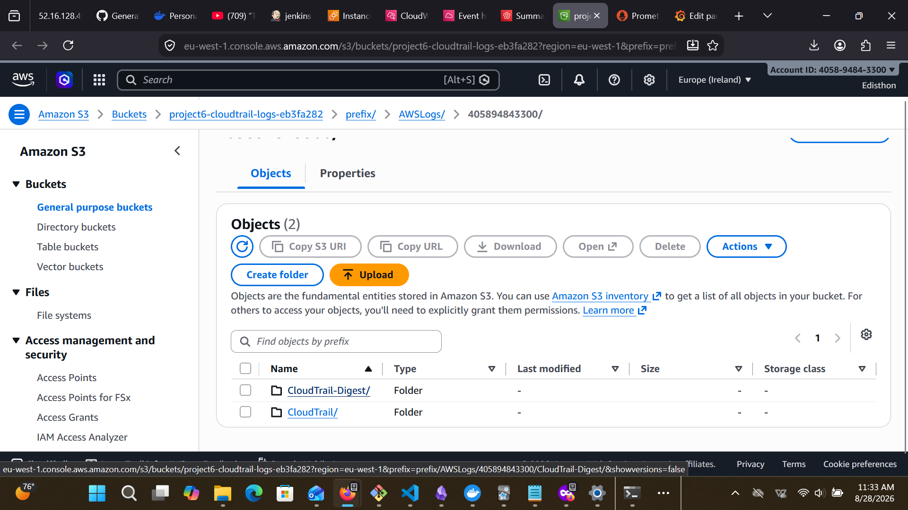
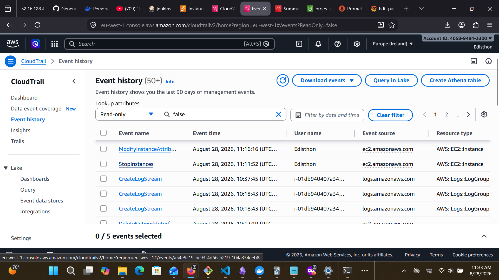

# Module 8: Comprehensive Monitoring and Observability Report

## 1. Executive Summary
This project demonstrates the implementation of a robust, enterprise-grade observability and security monitoring stack for a Flask application deployed via a modern CI/CD pipeline. The infrastructure was provisioned as code using Terraform on AWS, configured using Ansible, and containerized with Docker. The primary goal was to achieve a "Single Pane of Glass" visibility into application health, infrastructure performance, and cloud security.

## 2. Infrastructure & Application Monitoring (Prometheus & Grafana)
A dedicated Monitoring Server was deployed to host **Prometheus** and **Grafana** via Docker Compose. 

### Prometheus Configuration
Prometheus was configured as the central time-series database. It was designed to scrape two primary targets on the Production Server:
1. **Application Metrics:** The Flask application was instrumented with `prometheus-flask-exporter` to expose HTTP metrics on port `80`.
2. **Infrastructure Metrics:** `Node Exporter` was installed as a systemd service via Ansible to expose hardware vitals (CPU, RAM, Disk) on port `9100`.

*Security Note:* To adhere to AWS networking best practices, Prometheus was configured to scrape these targets using the Production Server's **Private IP Address** rather than the Public IP. This ensures that metric traffic remains securely isolated within the VPC, reducing latency and avoiding public data egress.

### Grafana Visualization and Alerting
Grafana was linked to Prometheus to visualize the scraped data. 
- **Dashboards:** Dashboards were constructed to track critical application KPIs, specifically **Requests Per Second**, **Latency**, and **Error Rates** (`flask_http_request_total`). Additionally, an infrastructure dashboard was imported to visualize Node Exporter metrics (CPU/Memory utilization).

- **Alerting:** An alert rule was configured to monitor the Application Error Rate. If the error rate exceeds 5% for a sustained period, Grafana is configured to fire an alert to a designated Contact Point (e.g., Slack Webhook or Email).

## 3. Centralized Logging (AWS CloudWatch)
Instead of relying on ephemeral Docker logs stored locally on the EC2 instance, the Production Server's Docker daemon was configured via Ansible to use the `awslogs` driver. 
- All standard output (stdout) and standard error (stderr) from the Flask container are instantly streamed to the `flask-app-logs` Log Group in AWS CloudWatch in the `eu-west-1` region.
- This decoupling of logs from the compute layer ensures that even if the EC2 instance crashes or is destroyed, the historical application logs remain safely preserved and searchable in CloudWatch.

## 4. Security Auditing and Threat Detection

### AWS CloudTrail
To achieve complete compliance and auditability, AWS CloudTrail was provisioned via Terraform.
- A multi-region trail was created to track every API call made within the AWS account.
- The logs are securely delivered to a dedicated S3 bucket configured with restrictive IAM bucket policies. 

- **Insight Gained:** CloudTrail successfully captured machine-to-machine API calls, such as the Production EC2 instance utilizing its attached IAM Role to autonomously invoke `CreateLogGroup` and `CreateLogStream` in CloudWatch. This proves the principle of least privilege was successfully implemented.

### AWS GuardDuty
AWS GuardDuty was enabled via Terraform to act as the primary threat detection system. 
- GuardDuty continuously analyzes the CloudTrail events, VPC Flow Logs, and DNS queries generated by the infrastructure.
- It leverages machine learning to identify anomalous behavior, such as unauthorized access attempts, cryptocurrency mining, or communication with known malicious IP addresses, adding an automated layer of security to the environment.

## 5. Key Insights and Conclusion
The implementation of this observability stack provided immediate, tangible benefits during the deployment lifecycle. For instance, when the Monitoring Server experienced an Out-Of-Memory (OOM) event due to the resource-intensive nature of Prometheus on a `t3.micro` instance, AWS CloudWatch metrics clearly displayed a sustained 70% CPU spike (due to disk swapping/thrashing) while the Status Checks remained passing. 

By correlating this CloudWatch infrastructure data with the failure of the Grafana UI, we were able to quickly diagnose the memory starvation, execute a Terraform hardware upgrade to a `t3.small` instance, and implement Ansible handlers to ensure Docker containers automatically restarted on boot. 

Ultimately, combining Prometheus, Grafana, CloudWatch, CloudTrail, and GuardDuty bridges the gap between Development, Operations, and Security, creating a highly resilient and transparent cloud architecture.
