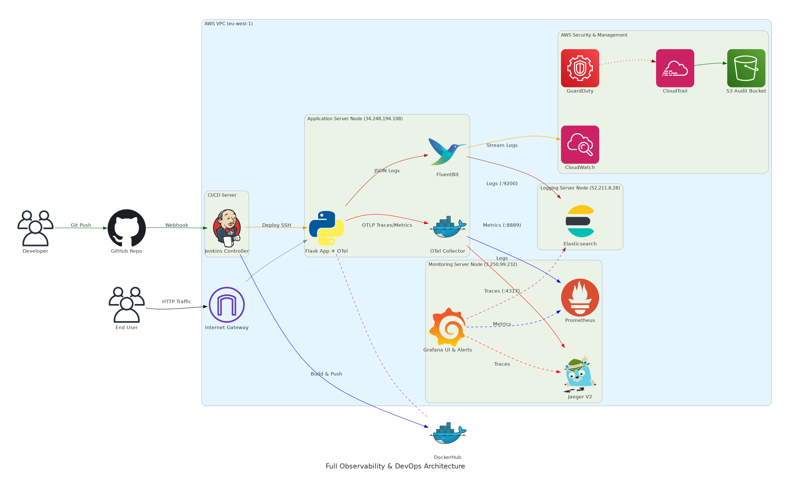
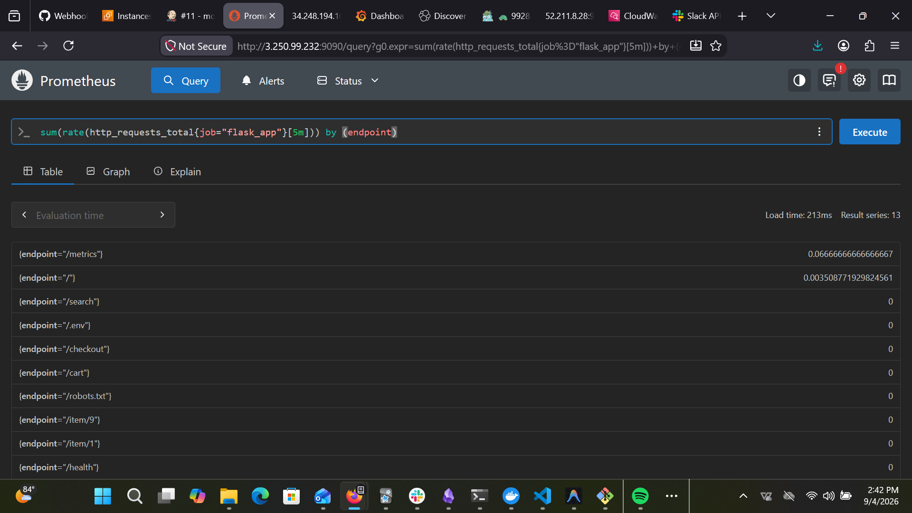
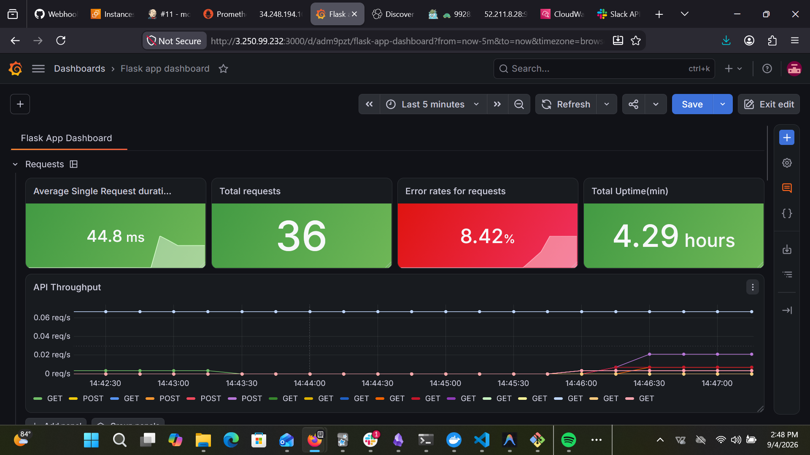
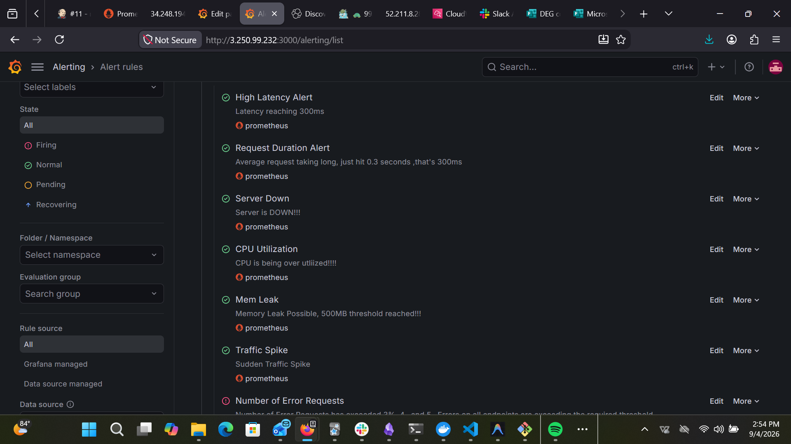
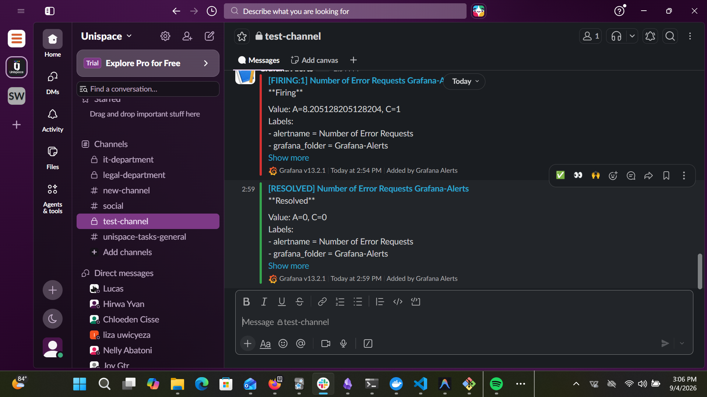
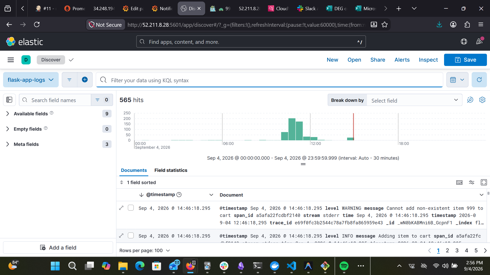
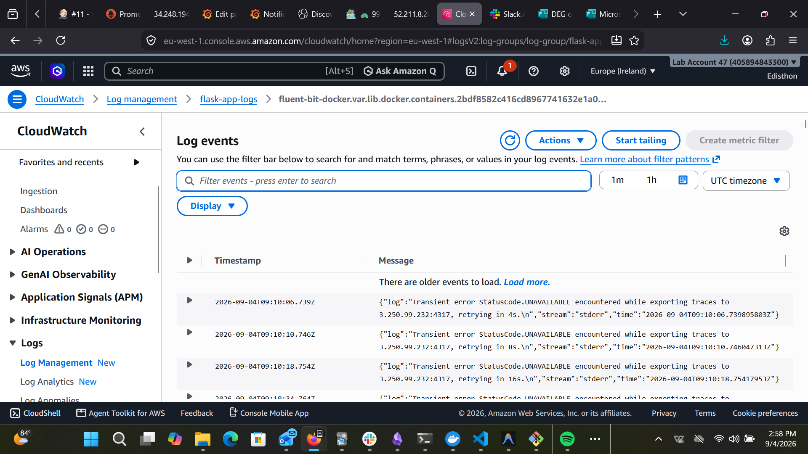
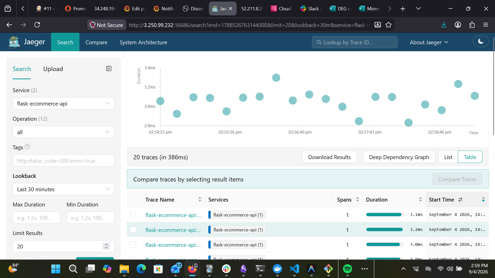
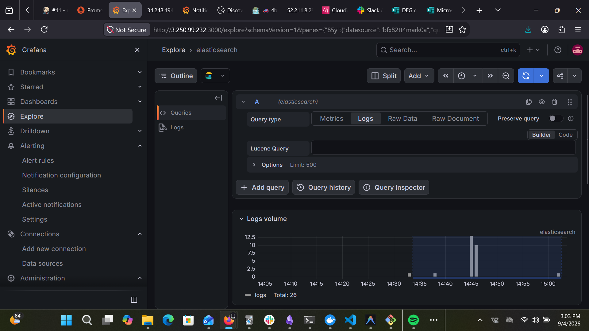

# Comprehensive Observability & DevOps Platform Documentation

## Executive Summary

This document provides complete technical documentation for the end-to-end Observability and DevOps platform deployed in AWS. The architecture integrates automated CI/CD deployment pipelines (Jenkins, Terraform, Ansible) with a full-stack observability suite comprising **OpenTelemetry**, **Prometheus**, **Grafana**, **Jaeger V2**, **FluentBit**, **Elasticsearch**, **Kibana**, and **AWS CloudWatch**.

The primary objective of this platform is to achieve total system visibility across the **Three Pillars of Observability**:
1. **Metrics**: Real-time performance tracking and RED metrics (Rate, Errors, Duration) via Prometheus and Grafana.
2. **Traces**: End-to-end distributed transaction tracing via OpenTelemetry SDK and Jaeger V2.
3. **Logs**: Centralized, structured JSON log aggregation via FluentBit, Elasticsearch, Kibana, and AWS CloudWatch, correlated with distributed trace IDs.

---

## 1. System Architecture & Topology

The infrastructure is distributed across dedicated AWS EC2 instances running Ubuntu 24.04 LTS, separated by operational responsibilities:



### Server Node Mapping

| Component / Service | Host IP / Location | Exposed Ports | Function |
| :--- | :--- | :--- | :--- |
| **Flask Application** | App Server (`34.248.194.108`) | `5000` | Target Web App instrumented with OTel |
| **OTel Collector** | App Server (`34.248.194.108`) | `4317`, `4318`, `8889` | Receives telemetry and exports to Jaeger/Prometheus |
| **FluentBit** | App Server (`34.248.194.108`) | Daemon | Tails Docker container logs and ships to Elasticsearch & CloudWatch |
| **Prometheus** | Monitoring Server (`3.250.99.232`) | `9090` | Scrapes and stores metrics time-series |
| **Jaeger V2** | Monitoring Server (`3.250.99.232`) | `16686`, `4317` | Distributed trace storage and UI visualization |
| **Grafana** | Monitoring Server (`3.250.99.232`) | `3000` | Unified visualization, dashboards, and alerting engine |
| **Elasticsearch** | Logging Server (`52.211.8.28`) | `9200` | Search engine for `flask-app-logs` index |
| **Kibana** | Logging Server (`52.211.8.28`) | `5601` | Log analytics UI and discover visualization |
| **Jenkins** | CI/CD Server | `8080` | Pipeline orchestration and automated deployment |

---

## 2. Infrastructure as Code & Automated Provisioning

The infrastructure and services are fully automated using **Terraform** for cloud infrastructure and **Ansible** for configuration management.

### Infrastructure Provisioning (Terraform)
* **AWS VPC & Security Groups**: Configured to restrict traffic to necessary ports (`22`, `80`, `443`, `3000`, `5000`, `9090`, `9200`, `5601`, `16686`, `4317`).
* **EC2 Provisioning**: Dynamic provisioning of Ubuntu instances with SSH keys managed via Terraform outputs.

### Automated Deployment (Ansible Roles)
* `monitoring_setup`: Installs Docker Engine, configures `prometheus.yml`, deploys Jaeger V2 container (`jaegertracing/jaeger:latest`), and launches OpenTelemetry Collector container.
* `logging_setup`: Configures Elasticsearch and Kibana on the logging node and deploys FluentBit with custom parsers.
* `app_deployment`: Deploys the Flask application with Python dependencies and OTel instrumentation packages.

---

## 3. Application Instrumentation & Telemetry Generation

The core application is a Flask service (`app/app.py`) instrumented with **OpenTelemetry Python SDK**.

### Python OTel Setup
```python
from opentelemetry import trace, metrics
from opentelemetry.instrumentation.flask import FlaskInstrumentor
from opentelemetry.sdk.trace import TracerProvider
from opentelemetry.sdk.trace.export import BatchSpanProcessor
from opentelemetry.exporter.otlp.proto.grpc.trace_exporter import OTLPSpanExporter

# Trace Provider & OTLP Exporter Configuration
provider = TracerProvider()
processor = BatchSpanProcessor(OTLPSpanExporter(endpoint="http://localhost:4317", insecure=True))
provider.add_span_processor(processor)
trace.set_tracer_provider(provider)
tracer = trace.get_tracer(__name__)

FlaskInstrumentor().instrument_app(app)
```

### Contextual JSON Logger
Log entries are formatted as JSON and injected with `trace_id` and `span_id` extracted from the active OTel context:
```python
class JsonFormatter(logging.Formatter):
    def format(self, record):
        span = trace.get_current_span()
        ctx = span.get_span_context()
        log_record = {
            "timestamp": self.formatTime(record, self.datefmt),
            "level": record.levelname,
            "message": record.getMessage(),
            "trace_id": format(ctx.trace_id, "032x") if ctx.is_valid else None,
            "span_id": format(ctx.span_id, "016x") if ctx.is_valid else None,
            "logger": record.name
        }
        return json.dumps(log_record)
```

---

## 4. Visualization & Observability Tooling (Detailed Deep-Dive)

This section provides extensive technical documentation and visualization evidence for every monitoring and logging component deployed in the cluster.

---

### 4.1 Prometheus Target & Metrics Visualization

Prometheus acts as the primary time-series metrics storage engine. It periodically scrapes application and infrastructure endpoints over private VPC networks.

#### Technical Details
* **Scrape Configuration**: Configured via `prometheus.yml` to target the OTel Collector exporter (`34.248.194.108:8889`) and Node Exporter (`34.248.194.108:9100`).
* **PromQL Queries Used**:
  * Request Rate: `sum(rate(flask_http_request_total[1m]))`
  * System CPU Load: `100 - (avg by (instance) (irate(node_cpu_seconds_total{mode="idle"}[5m])) * 100)`

#### Screenshot Placeholder


---

### 4.2 Grafana Dashboards & Alert Rules Visualization

Grafana provides unified single-pane-of-glass dashboards and an automated alerting engine.

#### Technical Details
* **RED Metrics Panels**: Renders Request Rate (RPS), Error Percentage (5xx status codes), and 95th Percentile Latency (Duration).
* **Alert Rule Evaluation**: Evaluates metric rules every 1 minute. Triggers when error rate exceeds 5% or latency exceeds 300ms.
* **Notification Channels**: Integrates with Slack / Discord via Webhooks (`https://hooks.slack.com/...`).

#### Screenshot Placeholders





---

### 4.3 Kibana Discover & Log Analytics Visualization

Kibana runs on the Logging Server (`http://52.211.8.28:5601`) and serves as the visual interface for Elasticsearch log indices.

#### Technical Details
* **Index Pattern**: `flask-app-logs*` tracking container stdout/stderr.
* **Filtering Capabilities**: Full-text search and field-level queries (e.g. `level: "ERROR"`, `trace_id: "99283508a1c4b72e9a..."`).
* **Log Record Breakdown**: Displays timestamps, host metadata, Python log level, message body, and correlated trace identifiers.

#### Screenshot Placeholder


---

### 4.4 AWS CloudWatch Log Groups & Streams Visualization

AWS CloudWatch provides cloud-native log stream preservation via the Docker container `awslogs` driver.

#### Technical Details
* **Log Group**: `flask-app-logs` located in region `eu-west-1`.
* **Log Stream Naming**: `fluent-bit-docker.var.lib.docker.containers...`
* **Filter Pattern Syntax**: Supports Lucene and JSON property filters:
  * String match: `"99283508a1c4b72e9a..."`
  * JSON field filter: `{ $.trace_id = "99283508a1c4b72e9a..." }`

#### Screenshot Placeholder

---

### 4.5 Jaeger Distributed Tracing & Waterfall Visualization

Jaeger V2 (`http://3.250.99.232:16686`) records distributed transaction traces generated by the OpenTelemetry Python SDK.

#### Technical Details
* **Service Name**: `flask-service`
* **Operation Spans**: Traces incoming HTTP calls (`/checkout`, `/pay`, `/metrics`) and internal database calls.
* **Span Attributes**: Captures `http.status_code`, `http.method`, `http.target`, duration in milliseconds, and span event stack traces.

#### Screenshot Placeholder

---

### 4.6 Unified Trace-Log Correlation (Grafana Explore Split View)

Trace-Log correlation enables operators to navigate from high-level Jaeger latency spans directly to Elasticsearch log entries using `trace_id` as the join key.

#### Technical Details
* **Correlation Key**: `trace_id` (32-character hexadecimal string).
* **Explore Split View**: Left pane displays Jaeger trace waterfall; Right pane displays Elasticsearch log entries matching `trace_id: "<TRACE_ID>"`.
* **Root Cause Identification**: Directly maps HTTP 500 trace spikes to exact Python application stack traces (`"message": "Checkout failed! Simulated error injected"`).

#### Screenshot Placeholder


---

## 5. Key Insights and Conclusion

The implementation of this observability stack provides complete visibility across Metrics, Traces, and Logs:
- **Reduced MTTD/MTTR**: `trace_id` correlation eliminates manual log grepping during production outages.
- **Proactive Notifications**: Automated Webhook dispatches alert engineering teams before users experience service degradation.
- **Reproducible Infrastructure**: IaC via Terraform and Ansible ensures rapid deployment and audit compliance.
