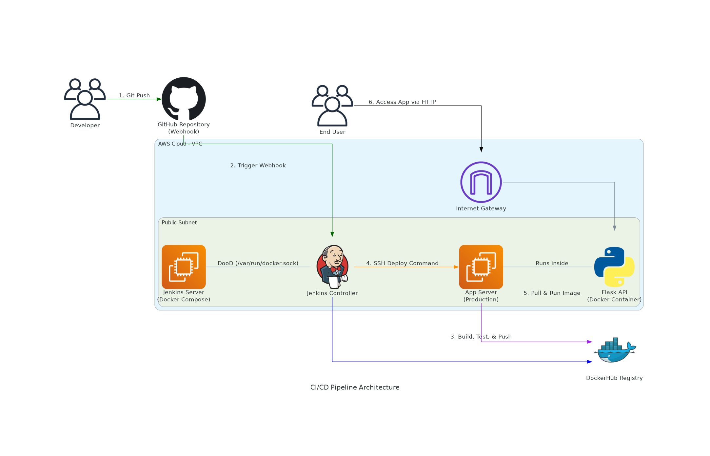
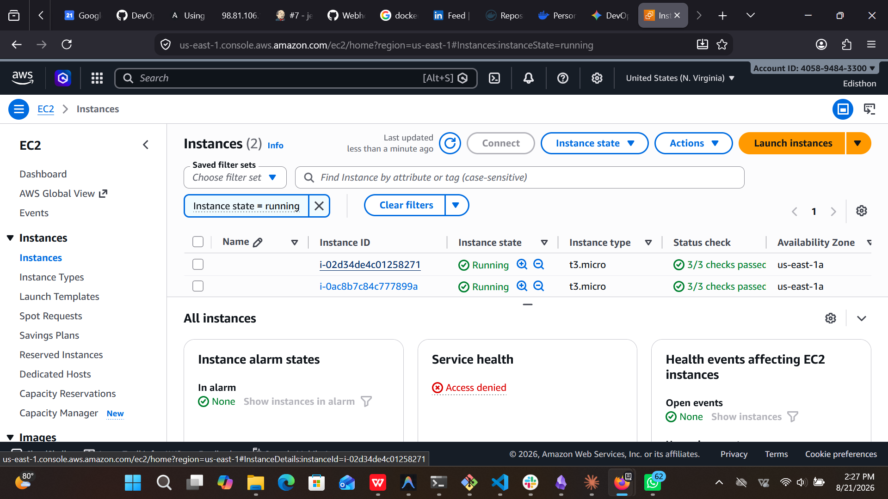
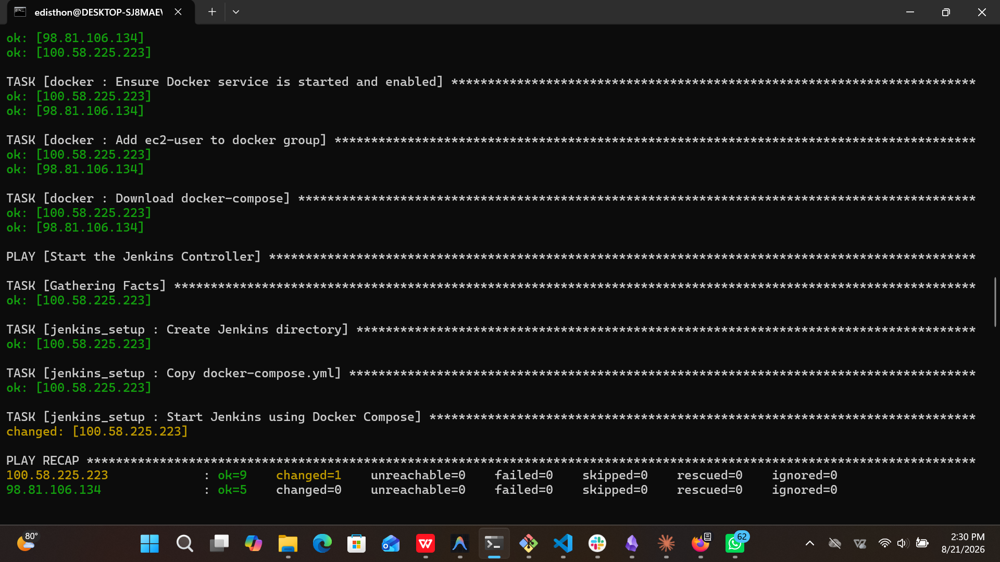
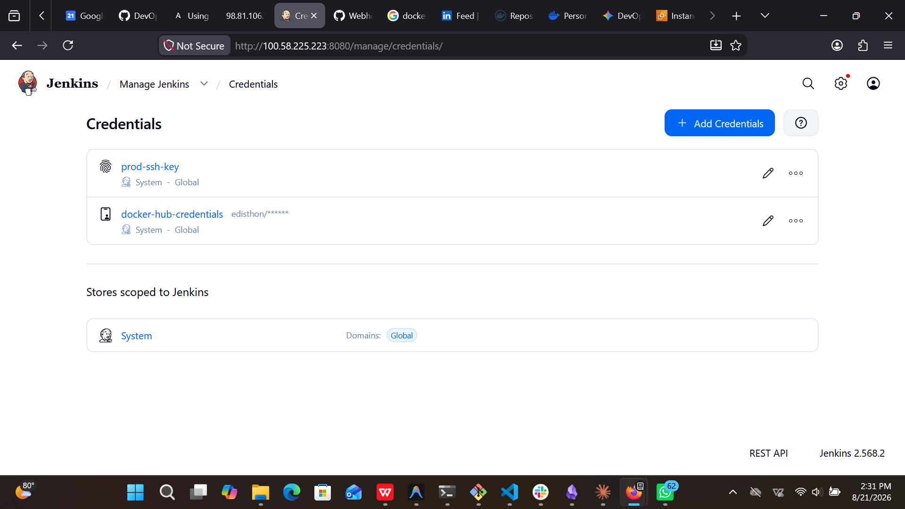
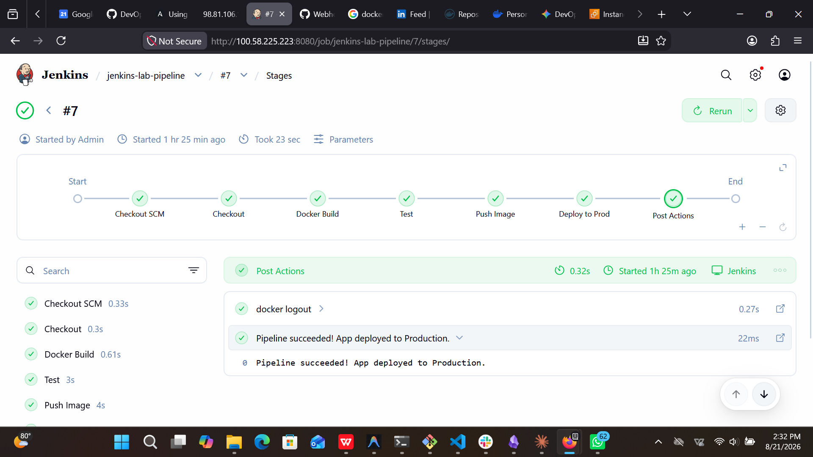
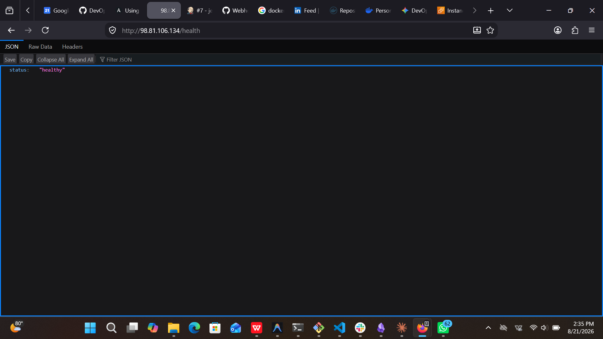
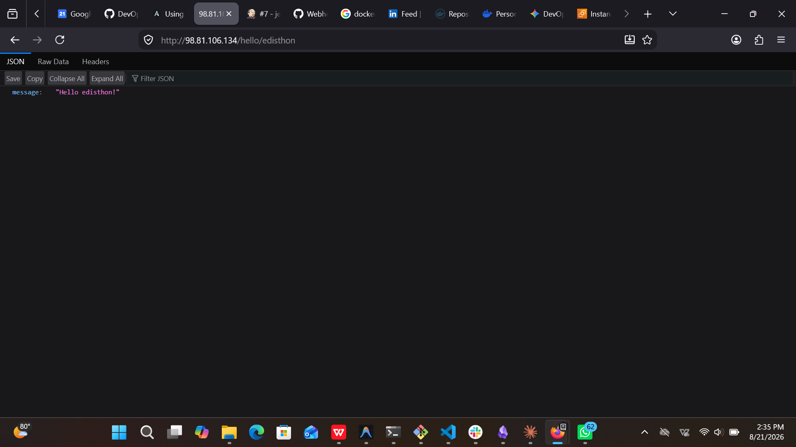

# Complete CI/CD Pipeline with Jenkins, Terraform, and Ansible

**Objective:** Design and implement an end-to-end CI/CD pipeline in Jenkins that builds, tests, containerizes a simple web service, pushes the image to a registry, and deploys it to an EC2 host.

---

## Infrastructure Architecture

The following diagram illustrates the flow of our CI/CD pipeline, from pushing code to deploying the containerized application.ss

---

## 1. Infrastructure Provisioning (Terraform)

The infrastructure was provisioned using Terraform with a modular approach, separating the networking, security, and compute resources. We also configured an S3 remote backend with DynamoDB state locking to ensure the state file is securely stored and managed.

### Infrastructure Components:
* **Backend:** S3 bucket for state storage and DynamoDB table for state locking.
* **Modules:** 
  * `network`: VPC, Subnets, Internet Gateway, and Route Tables.
  * `security`: SSH Key Pairs and Security Groups.
  * `compute`: EC2 instances for the Jenkins Controller and the Application Server.

### Provisioning Output
After running `terraform apply`, two EC2 instances were successfully provisioned.

---

## 2. Server Configuration (Ansible)

Instead of manually installing dependencies, we used Ansible to automate the configuration of our EC2 instances. 

### Configuration Details:
* **Docker Setup:** Installed Docker, started the service, and added the `ec2-user` to the `docker` group across all servers.
* **Jenkins Setup:** Used Docker Compose to pull the `jenkins/jenkins:lts` image and run Jenkins as a container. We implemented "Docker out of Docker" (DooD) by mounting the host's `/var/run/docker.sock` so Jenkins can build containers natively on the EC2 host.

---

## 3. Jenkins Configuration

With the Jenkins server running, we completed the initial setup by installing the required plugins and securely configuring our credentials.

### Installed Plugins:
* Pipeline
* Git
* Credentials Binding
* Docker Pipeline
* SSH Agent
* And other default ones

### Credentials Configured:
* `docker-hub-credentials`: Username and password for pushing images to DockerHub.
* `prod-ssh-key`: The private SSH key used to securely deploy containers to the App Server.

---

## 4. CI/CD Pipeline Overview

We created a declarative pipeline (`Jenkinsfile`) that triggers automatically via a GitHub Webhook on every code push. 

### Pipeline Stages:
1. **Checkout:** Pulls the latest code from the GitHub repository.
2. **Docker Build:** Builds the Flask application into a Docker image.
3. **Test:** Spins up a temporary container to run unit tests (`pytest`) against the new image.
4. **Push Image:** Authenticates with DockerHub and pushes the verified image.
5. **Deploy to Prod:** SSH's into the App Server, pulls the latest image, stops the old container, and spins up the new application container.

---

## 5. Final Output & Application Accessibility

After the pipeline successfully completes, the web service is immediately available to the public. 

### Server Details:
* **Jenkins Server IP:** `http://100.58.225.223:8080`
* **Production App Server IP:** `http://98.81.106.134`

### Application Endpoints:
The Flask API currently exposes three endpoints:
* **Home (`/`):** Returns the base welcome message.
* **Health Check (`/health`):** Returns the operational status of the app.
* **Dynamic Greeting (`/hello/<name>`):** Returns a personalized greeting.

### Accessibility Evidence:

